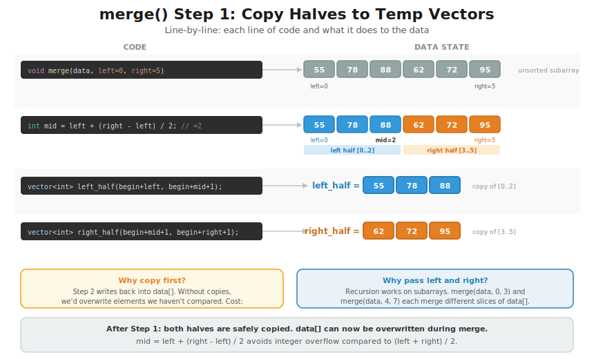
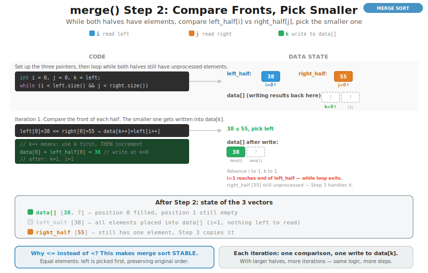
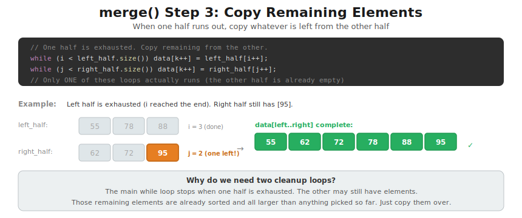
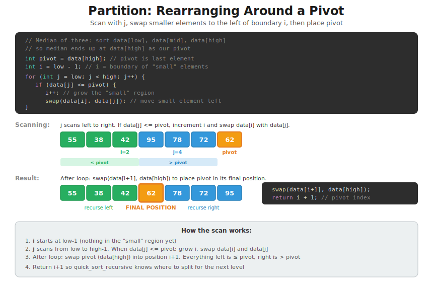
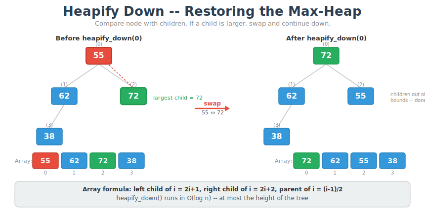

# CT13 -- Implementation Diagrams

Code-block diagrams referenced from `EfficientSorts.cpp`.

---

## 1. merge() Step 1: Copy Halves to Temp Vectors
*`EfficientSorts.cpp::merge()` -- copy left and right halves before merging (why O(n) space)*

---

## 2. merge() Step 2: Compare Fronts, Pick Smaller
*`EfficientSorts.cpp::merge()` -- the main merge loop with i, j, k pointers*

---

## 3. merge() Step 3: Copy Remaining Elements
*`EfficientSorts.cpp::merge()` -- when one half runs out, copy the rest*

---

## 4. Partition: Rearranging Around a Pivot
*`EfficientSorts.cpp::partition()` -- scan with j, swap smaller elements left, place pivot*

---

## 5. Heapify Down: Restoring the Max-Heap
*`EfficientSorts.cpp::heapify_down()` -- compare with children, swap with largest, sink down*

