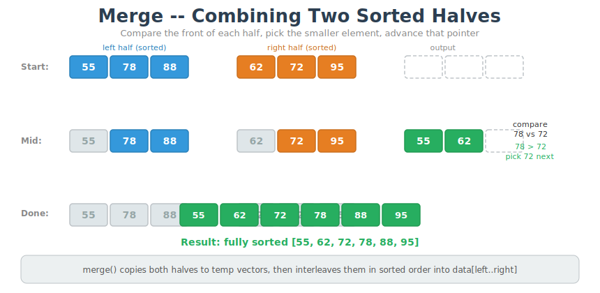
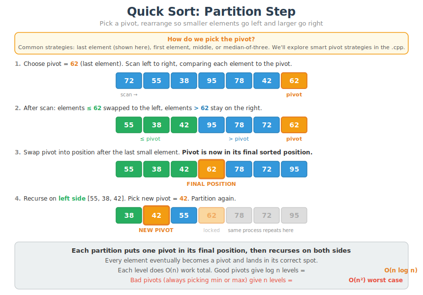
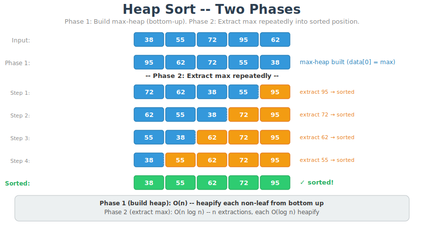

# CT13 -- Implementation Diagrams

Code-block diagrams referenced from `EfficientSorts.cpp`.

---

## 1. Merge -- Merging Two Sorted Halves
*`EfficientSorts.cpp::merge()` -- compare front of each half, pick smaller, repeat*

---

## 2. Merge Sort -- Divide and Conquer Tree
*`EfficientSorts.cpp::merge_sort_recursive()` -- split until single elements, merge back up*

---

## 3. Quick Sort -- Partition Step
*`EfficientSorts.cpp::partition()` -- pivot chosen, i tracks boundary, j scans, pivot placed*

---

## 4. Heap Sort -- Heapify Down
*`EfficientSorts.cpp::heapify_down()` -- small root sinks to correct level in max-heap*

---

## 5. Heap Sort -- Two Phases
*`EfficientSorts.cpp::heap_sort()` -- Phase 1: build max-heap. Phase 2: extract max repeatedly*

