# CT13 -- Implementation Diagrams

Code-block diagrams referenced from `EfficientSorts.cpp`.

---

## 1. Merge Sort: How the Three Functions Work Together
*Meet the three functions: merge_sort() is the public API, merge_sort_recursive() does the divide-and-conquer, and merge() does the actual merging work.*

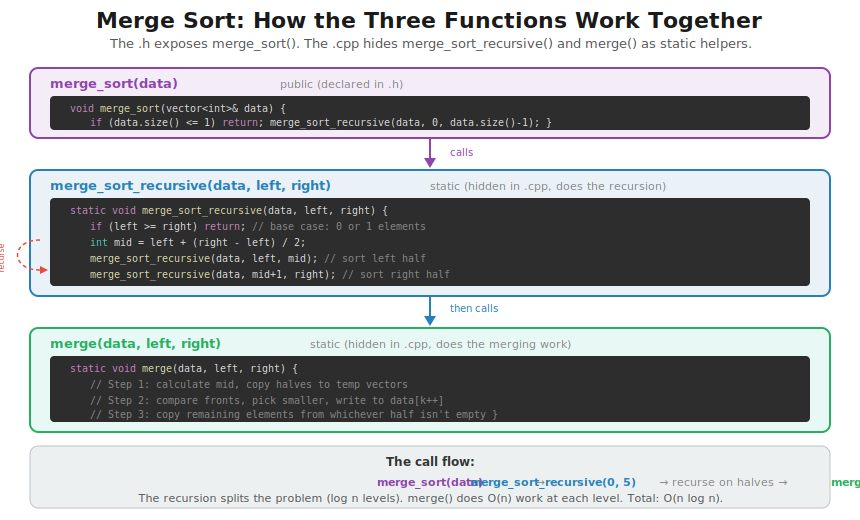

---

## 2. merge_sort(): The Public Entry Point
*`EfficientSorts.cpp::merge_sort()` -- the clean API that delegates to the recursive helper*

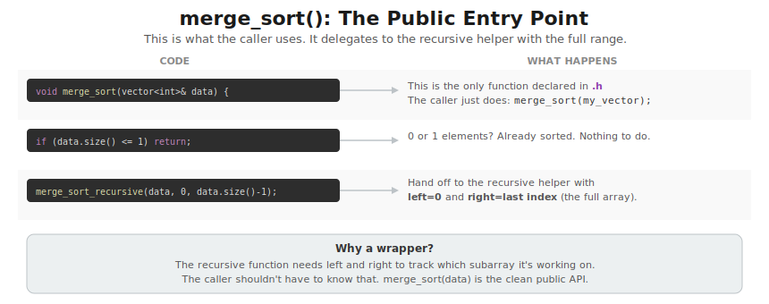

---

## 3. merge_sort_recursive(): The Recursion (Code)
*`EfficientSorts.cpp::merge_sort_recursive()` -- split in half, recurse, then merge*

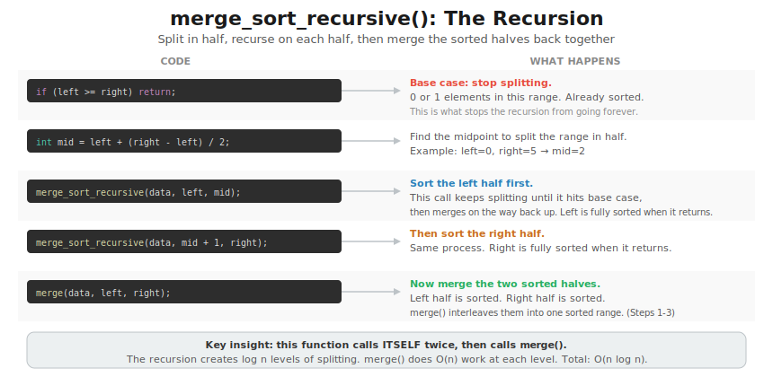

---

## 4. merge_sort_recursive(): Tracing the Calls
*Watch the recursion unfold on [38, 55, 32, 95] -- split down, merge back up*

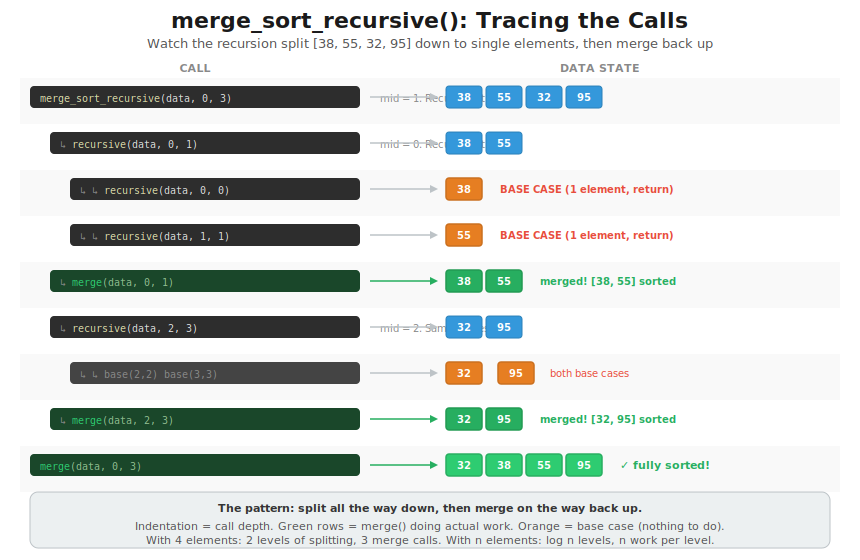

---

## 5. merge() Step 1: Copy Halves to Temp Vectors
*Now zooming into merge(), the function that merge_sort_recursive() calls at each level.*
*`EfficientSorts.cpp::merge()` -- calculate mid, copy left and right halves (why O(n) space)*

---

## 6. merge() Step 2: Compare Fronts, Pick Smaller
*`EfficientSorts.cpp::merge()` -- the main merge loop with i, j, k pointers*

---

## 7. merge() Step 3: Copy Remaining Elements
*`EfficientSorts.cpp::merge()` -- when one half runs out, copy the rest*

---

## 8. merge() Final Merge -- Step 1: Copy Halves to Temp Vectors
*Now merging the full array: merge(data, 0, 1, 3) -- combining [38, 55] and [32, 95]*

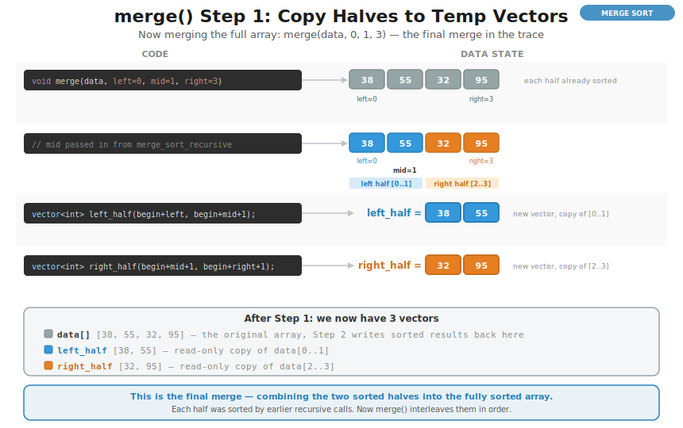

---

## 9. merge() Final Merge -- Step 2: Compare Fronts, Pick Smaller
*Three iterations this time -- watch 32 win first, then 38, then 55*

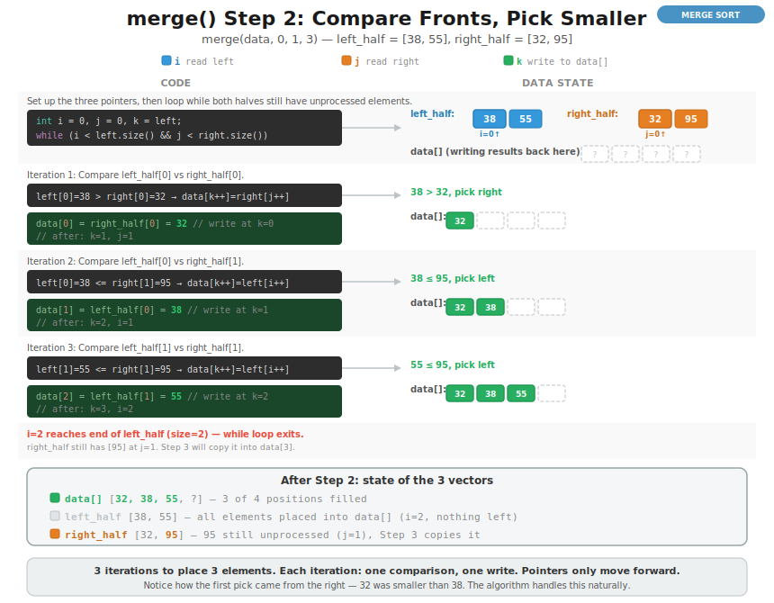

---

## 10. merge() Final Merge -- Step 3: Copy Remaining Elements
*left_half exhausted, copy 95 from right_half -- array fully sorted!*

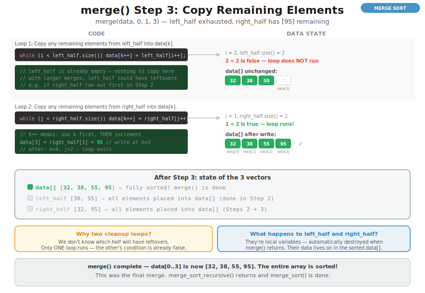

---

## 11. Quick Sort: How the Three Functions Work Together
*Meet the three functions: quick_sort() is the public API, quick_sort_recursive() does the divide-and-conquer, and partition() rearranges elements around a pivot.*

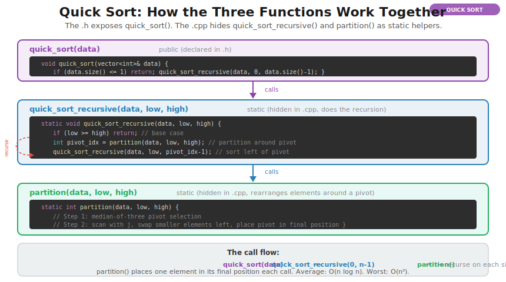

---

## 12. quick_sort(): The Public Entry Point
*`EfficientSorts.cpp::quick_sort()` -- the clean API that delegates to the recursive helper*

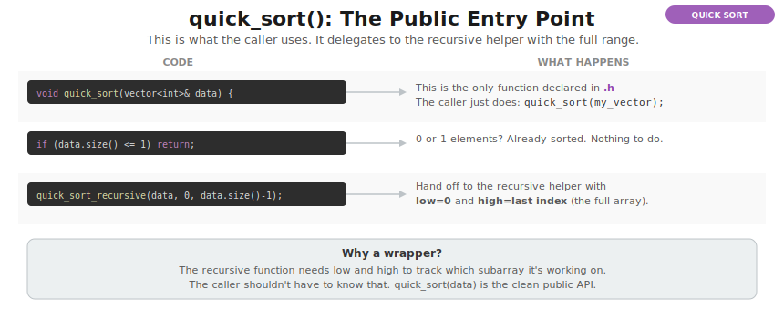

---

## 13. quick_sort_recursive(): The Recursion (Code)
*`EfficientSorts.cpp::quick_sort_recursive()` -- partition, then recurse on each side*

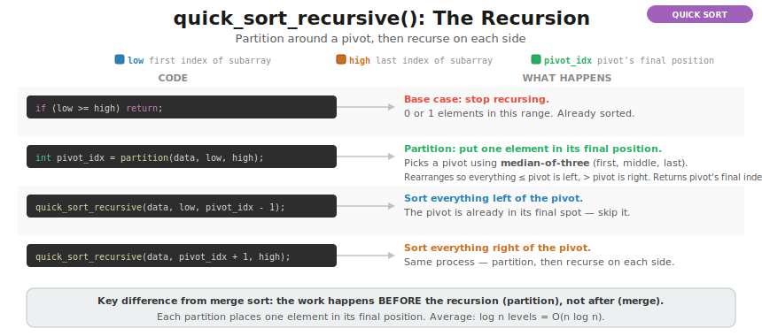

---

## 14. quick_sort_recursive(): Tracing the Calls
*Watch the recursion unfold on [38, 55, 32, 95] -- partition places pivots, then recurse each side*

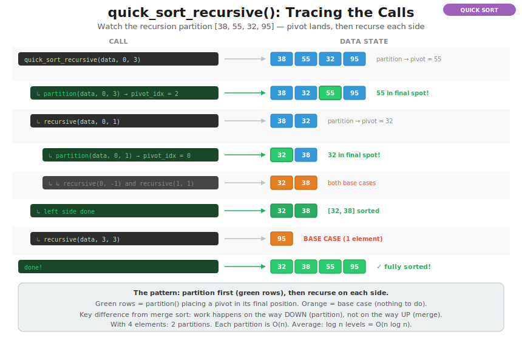

---

## 15. partition() Step 1: Median-of-Three Pivot Selection
*Pick the pivot using median-of-three, move it to data[high], initialize i*

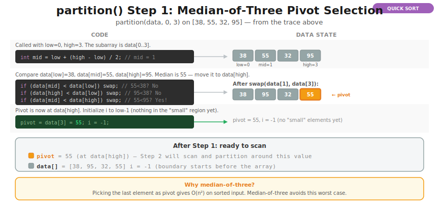

---

## 16. partition() Step 2: Scan and Swap
*j scans left to right. If data[j] &lt;= pivot, grow i and swap to move it left.*

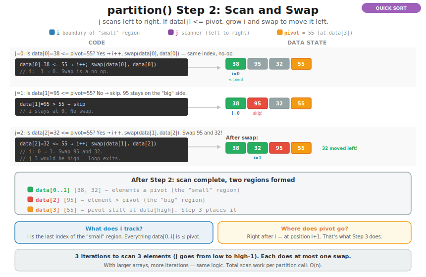

---

## 17. partition() Step 3: Place Pivot in Final Position
*Swap pivot into i+1. Everything left &lt;= pivot, everything right > pivot. Return i+1.*

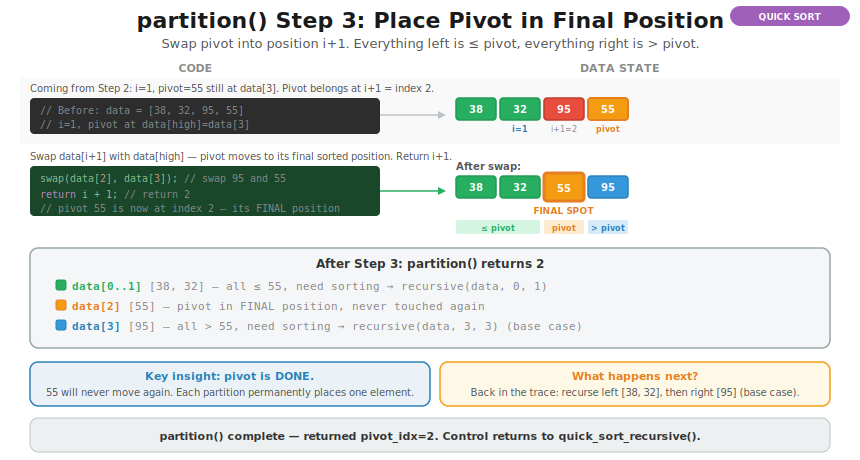

---

## 18. Heap Sort: How the Two Functions Work Together
*Just two functions: heap_sort() orchestrates both phases, heapify_down() does the heavy lifting.*

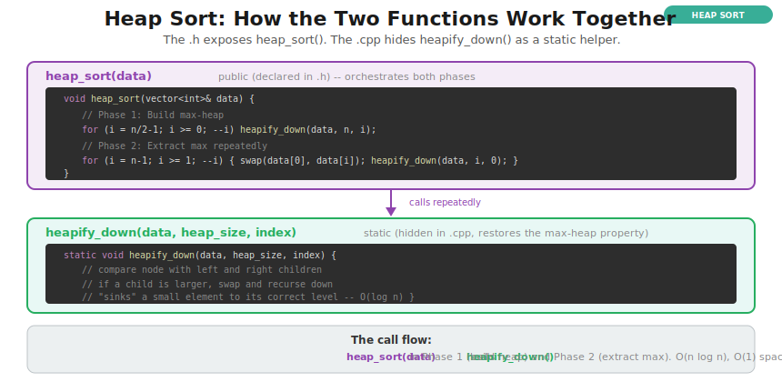

---

## 19. heap_sort(): Two Phases, One Helper
*`EfficientSorts.cpp::heap_sort()` -- Phase 1 builds the max-heap, Phase 2 extracts max repeatedly*

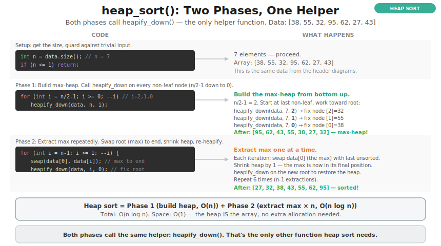

---

## 20. heapify_down(): Step-by-Step Code Walkthrough
*The mechanics inside every heapify_down call: find children, compare all three, swap if needed, recurse.*

---

## 21. Phase 1: Build the Max-Heap
*Call heapify_down on every non-leaf node (i=2,1,0). Transforms [38,55,32,95,62,27,43] into a max-heap.*

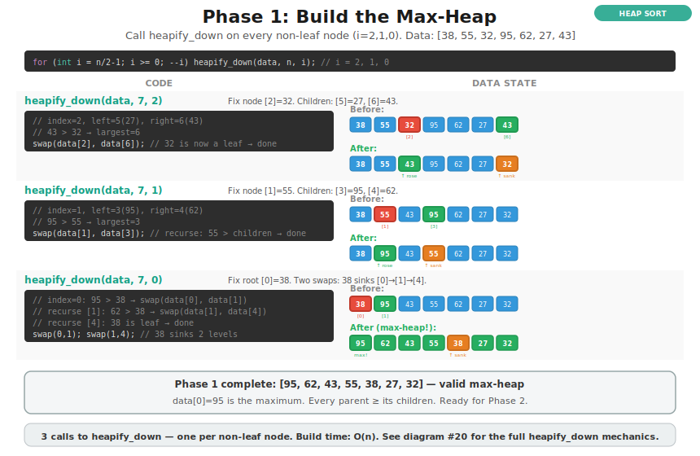

---

## 22. Phase 2: Extract Max Repeatedly
*Swap root to end, shrink heap, heapify_down on root. Sorted region grows from the right.*

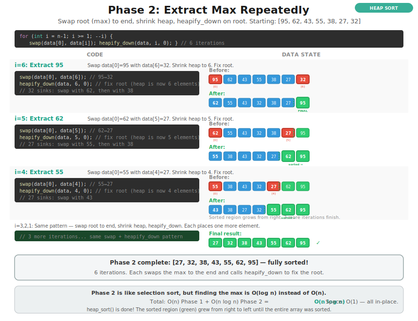