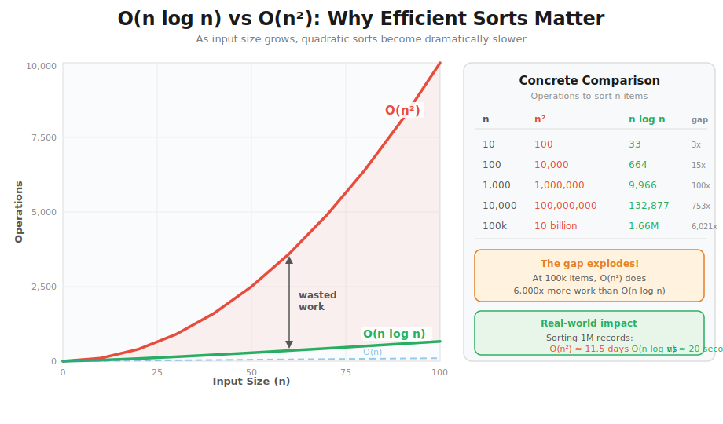
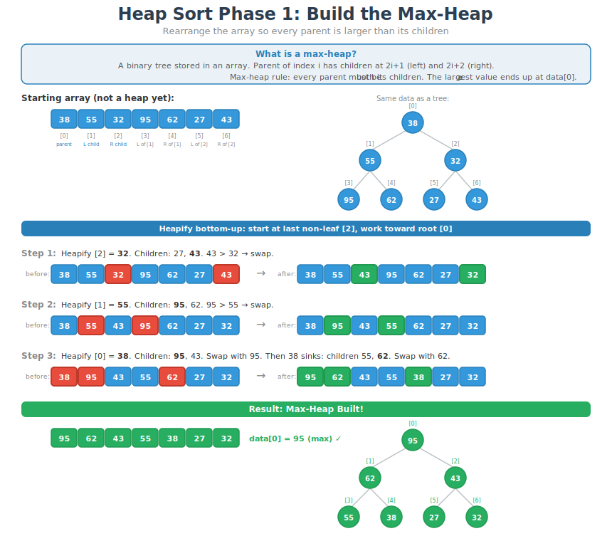
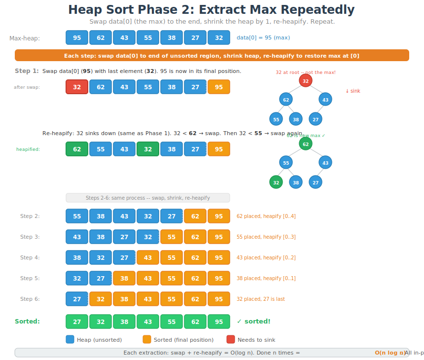

# CT13 -- Header Diagrams

Conceptual diagrams referenced from `EfficientSorts.h`.

---

## 1. The Three O(n log n) Sorts
*`EfficientSorts.h` -- what merge sort, quick sort, and heap sort are and how they work at a high level*

---

## 2. O(n log n) vs O(n^2) Growth Comparison
*`EfficientSorts.h` -- why moving from quadratic to n log n sorts matters at scale*

---

## 3. Why O(n log n): Divide and Conquer
*`EfficientSorts.h` -- all three sorts divide the problem into log n levels with O(n) work each*

---

## 4. Merge Sort -- Divide and Conquer Tree
*`EfficientSorts.h` -- split until single elements, then merge sorted halves back up*

---

## 5. Quick Sort -- Partition Step
*`EfficientSorts.h` -- pick a pivot, partition around it, recurse on each side*

---

## 6. Heap Sort Phase 1: Build the Max-Heap
*`EfficientSorts.h` -- rearrange the array so every parent is larger than its children*

---

## 7. Heap Sort Phase 2: Extract Max Repeatedly
*`EfficientSorts.h` -- swap max to end, shrink heap, re-heapify until sorted*

---

## 8. O(n log n) Sorts -- Side-by-Side Comparison
*`EfficientSorts.h` -- best/average/worst case, space, and stability at a glance*

