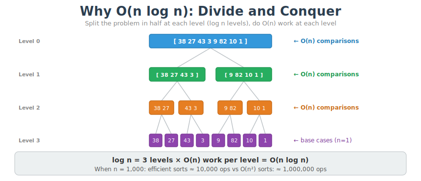
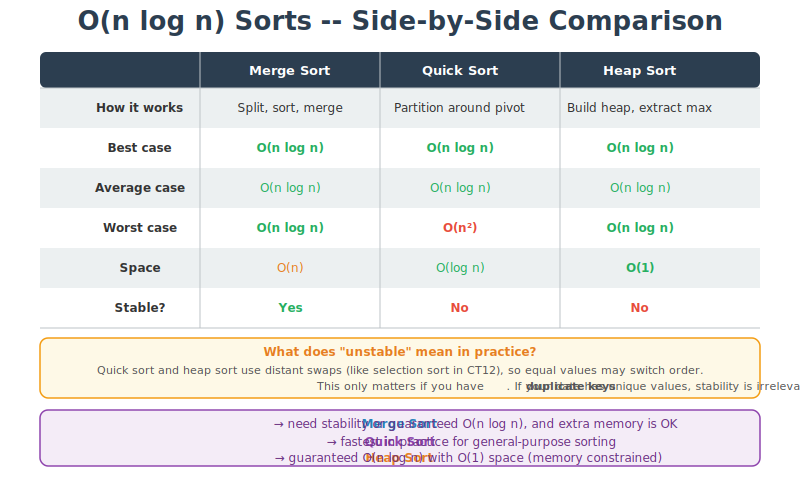

# CT13 -- Header Diagrams

Conceptual diagrams referenced from `EfficientSorts.h`.

---

## 1. Why O(n log n): Divide and Conquer
*`EfficientSorts.h` -- all three sorts divide the problem into log n levels with O(n) work each*

---

## 2. O(n log n) Sorts -- Side-by-Side Comparison
*`EfficientSorts.h` -- best/average/worst case, space, and stability at a glance*

